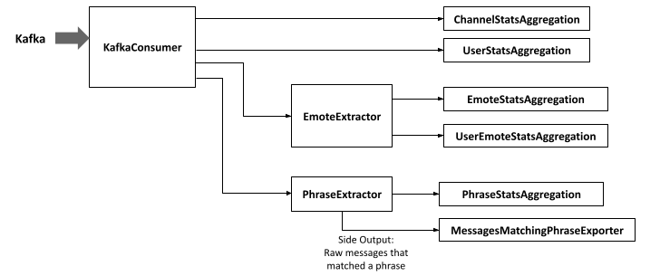

# Twitch Chat Analyser

## Setup

Create a Twitch App if you haven't already (https://dev.twitch.tv/console/apps/create) and keep the client-id and client secret ready.

1. Build app: `./gradlew build`

2. Install dashboard dependencies: In `dashboard` directory, run `composer install`

3. Configure bot by copying `bot.example.properties` to `bot.properties` and adjusting as needed.

4. Configure Flink job by copying `job.example.properties` to `job.properties` and adjusting as needed.

5. Start complete docker setup: `docker-compose up -d`

6. Once the Flink dashboard is up (http://localhost:8081), submit Flink Streaming Job with `submit.py`

7. The app will periodically fetch subscriber emotes for all channels in the `channels` table; as well as all globally known emotes (Twitch + BTTV + FFZ + 7TV):

	* Unfortunately, you currently have to figure out the emote set ID you want to track manually. You can do this buy (re-)loading the channel page while having the
	  Network tab open with the browser's developer console. The Emote Set will be somewhere hidden in a GQL request. You can start by searching (Ctrl+F) for `emoteSetID` or a specific emote of that channel. You may also try to search for `availableEmoteSets` and dig through it's contents.
	  
	  Note that some channels even have multiple emote sets, e.g. for different subscription tiers. Unfortunately, this analyser currently has no clean support for that.

	  Once you have the emote set id, add the channel, e.g.:

	  ```
	  INSERT INTO channels(channel, emote_set) VALUES('lirik', 27);
	  ```

	* To add channels, adjust the `channels` property in `bot.properties` and restart the bot with `docker-compose restart bot`

	* To manually add emotes to track (e.g. from channels you don't want to track):

		```
		$ docker exec -ti tca_db psql -Upostgres -dtwitch
		twitch=# INSERT INTO emotes(name) VALUES ('Kappa'), ('PogChamp'), ...;
		```

The Flink Web Panel will be available at `localhost:8081`. The dashboard is available at `localhost:8082`.

To get into the Postgres shell, use `docker-compose exec -ti postgres psql -Upostgres -dtwitch`


## Flink Job

The main entrypoint is in `EmoteAnalyser`.



https://docs.google.com/drawings/d/1m1V-LRHvXiIW-7Fq5CdbnZUVssn3EcC3L6ZxkM-hhW4/edit

### Aggregation implementation
- Aggregators are specific implementations of `AbstractStatsAggregation`.
- Aggregation works by first mapping into "XXXStats" objects, which are also per-time-window.
- Then a low-level process() does the piece-wise aggregation. Using per-key processing-time timers (`aggregationInterval`), the aggregated stats objects are then flushed to the exporter.
- In the exporter(s), they are converted to UPSERTs which are buffered in batches until either the batch is full or a checkpoint barrier is reached. In either case, they batches are flushed and written to the DB, but not yet committed.
- The exporter implementation is transactional. The transactions are committed during checkpoints. Thus, a 2-phase-commit protocol is implemented.

### Latency considerations
The maximum latency is `aggregationInterval + checkpointInterval`, ignoring processing and database write latencies. This is for the case, that a message is received right at the start of a new aggregation interval, is then pushed downstream after `aggregationInterval`, arrives at the exporter right after the start of a new checkpoint interval and then gets buffered until the commit after `checkpointInterval`.

If, for example, `aggregationInterval = 30s` and `checkpointInterval = 5min`, then in the worst case, you may only see a database update after 5.5min after the message entered the pipeline.

In the best case, a message arrives for an existing key right before the end of its aggregation interval, and is written by the exporter right before a checkpoint barrier (and is therefore commited right away). Then, the latency is only limited by processing and write latencies, and should be close to 0s.


## Phrases

Phrases are configured in the `phrases` table and are matched case insensitive.

You can optionally filter by channel (default `NULL`, i.e. match any channel). Additionally, if you set `log_message` to `true` (default `false`), any message that matched a phrase at least once, will be logged to the `messages_matching_phrase` table.

Examples:

```sql
INSERT INTO phrases("name", "regex") VALUES('furry', 'furr+y+');

INSERT INTO phrases("name", "regex", "log_message", "channel_filter_regex")
    VALUES('xqc_roulette', '^!roulette (all|\d+k?)', true, 'xqcow');
```


## Processing a large batch of messages

To process historic messages you may want to load a large batch of messages into Kafka.
Since the current configuration is tuned for latency, processing of this batch may be slow.

To improve the performance of the "batch" processing, alter the configuration in `submit.sh` to your needs:

- Choose a longer trigger interval

- Increase checkpoint interval
	- Checkpointing too often can stall the pipeline unnecessarily. This is especially unnecessary overhead when there is little risk of losing data (in the worst case, you have to start the processing again from the last checkpoint).
	- Checkpointing too rarely might mean you have to reprocess a lot, in case of a failure.

- Increase database output batch size
	- This is mainly dependent on the database (including full-stack configuration and hardware)
	- Tests have shown that the performance improves significantly until the optimal batch size was reached. Increasing the batch size any further only slightly decreases performance


## Troubleshooting

### Can't connect to port 8081 or 8082

Check your firewall settings for blocked INPUT routes or OUTPUT routes.

### Error: NoResourceAvailableException: Could not allocate all requires slots within timeout of 300000 ms

Check the "Available Task Slots" Flink Web Panel. By default, the app is configured to use parallelism 1, so you will need at least 4 available task slots. If none are available, make sure your Taskmanager container is running. 
